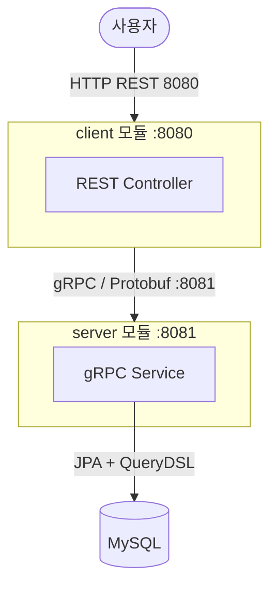

# gRPC Test Project

Spring Boot + Kotlin 기반의 gRPC 학습용 멀티 모듈 프로젝트입니다.

## 기술 스택

| 항목 | 버전 |
|---|---|
| Java | 21 |
| Kotlin | 2.2.21 |
| Spring Boot | 4.0.3 |
| Spring gRPC | 1.0.2 |
| QueryDSL | 5.1.0 |
| MySQL | 8.0 |
| Gradle | 9.3.1 (Kotlin DSL) |

---

## 프로젝트 구조

```
gRPC_test/
├── api/                    # Proto 정의 및 생성 Stub 공유 모듈
├── server/                 # gRPC 서버 (Spring Boot, 포트 8081)
├── client/                 # REST → gRPC 클라이언트 (Spring Boot, 포트 8080)
├── build.gradle.kts        # 루트 빌드 설정
└── settings.gradle         # 멀티 모듈 설정
```

### 모듈별 역할



---

## 모듈 설명

### api 모듈

Proto 파일을 정의하고, protoc로 생성된 Java Stub 클래스를 JAR로 패키징해 server/client가 공유합니다.

**서비스 정의** (`api/src/main/proto/book/book_service.proto`)

```protobuf
service BookService {
  rpc GetBook(GetBookRequest) returns (GetBookResponse);      // Unary
  rpc ListBooks(ListBooksRequest) returns (stream Book);      // Server Streaming
  rpc SearchBooks(SearchBooksRequest) returns (stream Book);  // Server Streaming
}
```

**자동 생성 클래스**

| 클래스 | 용도 |
|---|---|
| `BookServiceGrpc.BookServiceImplBase` | 서버 — RPC 구현 시 상속 |
| `BookServiceGrpc.BookServiceBlockingStub` | 클라이언트 — 동기 호출 |
| `Book`, `GetBookRequest`, `GetBookResponse` 등 | 메시지 클래스 |

---

### server 모듈

gRPC 서비스를 구현하는 Spring Boot 애플리케이션입니다.

**패키지 구조**

```
com.test.grpc_test.server
├── ServerApplication.kt
├── config/
│   ├── QueryDslConfig.kt           # JPAQueryFactory Bean
│   └── DataInitializer.kt          # 서버 시작 시 초기 데이터 insert
├── domain/
│   ├── BookEntity.kt               # JPA Entity (@Entity)
│   ├── BookJpaRepository.kt        # Spring Data JPA Repository
│   ├── BookQueryRepository.kt      # QueryDSL 기반 조회 (장르 필터, 키워드 검색)
│   └── BookRepository.kt           # BookEntity 조회 어댑터
├── interceptor/
│   ├── GlobalLoggingInterceptor.kt # 글로벌 인터셉터 (@GlobalServerInterceptor)
│   └── LoggingInterceptor.kt       # 서비스별 인터셉터 (@Component)
└── service/
    └── BookGrpcService.kt          # gRPC RPC 구현체 (@GrpcService)
```

**RPC 구현**

| RPC | 방식 | 설명 |
|---|---|---|
| `GetBook` | Unary | ID로 단건 조회 |
| `ListBooks` | Server Streaming | 장르 필터 목록 스트리밍 |
| `SearchBooks` | Server Streaming | 제목/저자 키워드 검색 스트리밍 |

---

### client 모듈

REST API를 노출하고, 내부적으로 gRPC를 통해 server를 호출하는 Spring Boot 애플리케이션입니다.

**패키지 구조**

```
com.test.grpc_test.client
├── ClientApplication.kt
├── config/
│   └── GrpcClientConfig.kt     # BlockingStub Bean 등록
├── controller/
│   └── BookController.kt       # REST endpoint
└── service/
    └── BookClientService.kt    # gRPC 호출 래핑
```

**REST API**

| Method | Path | gRPC 매핑 | 설명 |
|---|---|---|---|
| GET | `/books/{id}` | `GetBook` | 단건 조회 |
| GET | `/books?genre=&pageSize=` | `ListBooks` | 장르별 목록 |
| GET | `/books/search?q=&maxResults=` | `SearchBooks` | 키워드 검색 |

---

## 실행 방법

### 1. MySQL 시작 (Docker)

```bash
cd server
docker compose up -d
```

### 2. 서버 실행

```bash
./gradlew :server:bootRun
```

서버 시작 시 `DataInitializer`가 books 테이블에 초기 데이터 8건을 자동 insert합니다.

### 3. 클라이언트 실행

```bash
./gradlew :client:bootRun
```

### 4. 동작 확인

```bash
# 단건 조회 (Unary RPC)
curl http://localhost:8080/books/1

# 장르별 목록 (Server Streaming RPC)
curl "http://localhost:8080/books?genre=Architecture"

# 키워드 검색 (Server Streaming RPC)
curl "http://localhost:8080/books/search?q=Martin"
```

---

## 빌드

```bash
# 전체 빌드
./gradlew build

# Proto 컴파일만
./gradlew :api:generateProto

# 클린 빌드
./gradlew clean build
```

---

## 주요 설계 결정

### Proto → Stub 공유 방식
`api` 모듈에 `.proto` 파일을 두고 protoc로 컴파일한 결과물을 JAR로 패키징합니다.
`server`와 `client` 모두 `implementation(project(":api"))`로 동일한 Stub 클래스를 사용합니다.
이를 통해 Proto 계약을 단일 진실 공급원(Single Source of Truth)으로 관리합니다.

### gRPC 서버 방식
`spring-grpc-server-web-spring-boot-starter`를 사용해 Tomcat 위에서 HTTP와 gRPC를 동시에 처리합니다 (포트 8081).

### QueryDSL 적용
동적 조건 쿼리가 필요한 장르 필터(`findByGenre`)와 키워드 검색(`search`)에 QueryDSL을 적용했습니다.
kapt로 `QBookEntity`를 빌드 시 자동 생성합니다.

### gRPC 인터셉터

Spring gRPC에서 인터셉터는 등록 방식에 따라 적용 범위가 달라집니다.

#### 글로벌 인터셉터

`@GlobalServerInterceptor`를 사용하면 모든 gRPC 서비스에 자동으로 적용됩니다.
`@GlobalServerInterceptor`는 글로벌 인터셉터 마커 역할이고, 빈 등록은 `@Component`가 담당합니다. 두 어노테이션을 함께 사용해야 합니다.

```kotlin
@Component
@GlobalServerInterceptor
class GlobalLoggingInterceptor : ServerInterceptor {
    // 모든 gRPC 서비스 호출에 적용
}
```

#### 서비스별 인터셉터

`@Component`로만 등록하면 Spring 빈으로는 존재하지만 gRPC 인터셉터로는 자동 등록되지 않습니다.
`@GrpcService(interceptors = [...])` 에 명시한 서비스에만 적용됩니다.

```kotlin
@Component
class LoggingInterceptor : ServerInterceptor {
    // @GrpcService 에 명시된 서비스에만 적용
}

@GrpcService(interceptors = [LoggingInterceptor::class])
class BookGrpcService : BookServiceGrpc.BookServiceImplBase() {
    // GlobalLoggingInterceptor + LoggingInterceptor 둘 다 적용
}
```

#### 적용 순서

```
글로벌 인터셉터 (@GlobalServerInterceptor, @Order 순)
  → 서비스별 인터셉터 (@GrpcService interceptors 순)
    → 서비스 로직
```

`blendWithGlobalInterceptors = "true"` 옵션을 사용하면 글로벌/서비스별 구분 없이 `@Order` 기준으로 함께 정렬됩니다.